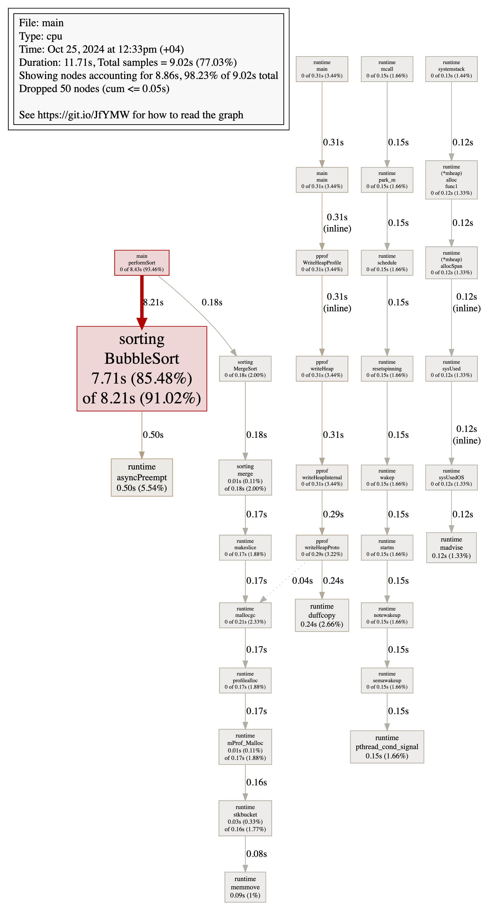
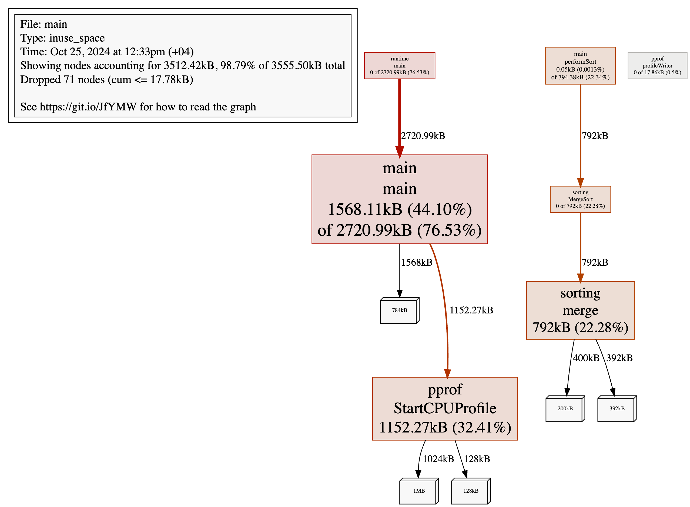
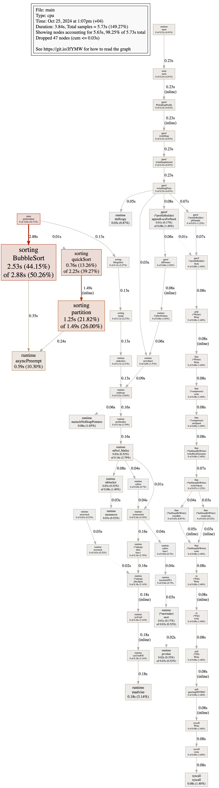
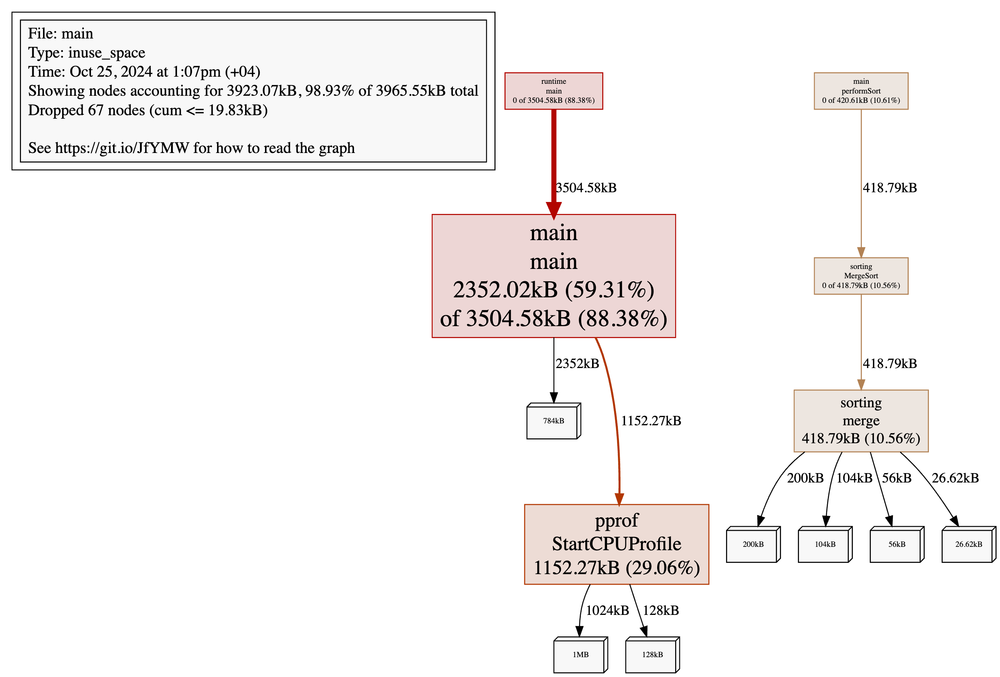

# Go pprof Demo with Sorting Algorithms

**by Tarlan Askaruly**

A demonstration project showcasing the usage of Go's pprof profiling tool through various sorting algorithm implementations. This project provides practical examples of CPU and memory profiling, highlighting performance characteristics of different sorting algorithms under various input conditions.

## Project Overview
This project implements multiple sorting algorithms and uses Go's built-in pprof profiling tools to analyze their performance characteristics. The implementation includes both sequential and concurrent execution of sorting algorithms, making it an excellent example for understanding performance profiling in Go.

## Folder Structure

```
.
├── sorting/
│   ├── bubble.go    # Bubble Sort implementation
│   ├── builtin.go   # Go's built-in sort package wrapper
│   ├── counting.go  # Counting Sort implementation
│   ├── merge.go     # Merge Sort implementation
│   └── quick.go     # Quick Sort implementation
├── cpu.prof         # CPU profile output
├── go.mod          # Go module file
├── main.go         # Main program file
└── mem.prof        # Memory profile output
```

## Usage

1. Clone the repository and navigate to the project directory
2. Run the program:
```bash
go run main.go
```
3. Analyze the CPU profile:
```bash
go tool pprof cpu.prof
```
- <b>top</b>: Show top CPU-consuming functions
- <b>web</b>: Generate a graph visualization (requires graphviz)
- <b>list</b>: Show line-by-line CPU consumption
4. Analyze the memory profile:
```bash
go tool pprof mem.prof
```
5. Generate visualization:

```bash
# Generate DOT file from CPU profile
go tool pprof -dot cpu.prof > cpu.dot

# Generate DOT file from memory profile
go tool pprof -dot mem.prof > mem.dot
```
You can visualize the DOT files using:
- Online tool: GraphvizOnline
- Local installation of Graphviz: dot -Tpng cpu.dot -o cpu.png

The visualization provides a graph where:
- Node size represents the relative time spent in each function
- Edge thickness shows the number of calls between functions
- Colors indicate the "heat" of functions (red = high CPU usage)

# Performance Analysis Results

## Test Case 1: Random Array (Size: 100,000)

### Execution Times:
```
Count Sort time taken: 3.446917ms
Quick Sort time taken: 18.280708ms
Builtin Sort time taken: 46.167833ms
Merge Sort time taken: 226.396833ms
Bubble Sort time taken: 11.144633625s
```

### CPU Profile Analysis:

This analysis shows that BubbleSort consumes the most CPU time (85.48% of total execution), which is expected due to its high time complexity. The function runtime.asyncPreempt also appears, indicating Go's asynchronous preemption handling. Other runtime functions show minimal CPU impact, suggesting that performance bottlenecks primarily lie in the sorting algorithm itself.

```
(pprof) top
Showing nodes accounting for 8.86s, 98.23% of 9.02s total
Dropped 50 nodes (cum <= 0.05s)
Showing top 10 nodes out of 33
      flat  flat%   sum%        cum   cum%
     7.71s 85.48% 85.48%      8.21s 91.02%  pprof-demo/sorting.BubbleSort
     0.50s  5.54% 91.02%      0.50s  5.54%  runtime.asyncPreempt
     0.24s  2.66% 93.68%      0.24s  2.66%  runtime.duffcopy
     0.15s  1.66% 95.34%      0.15s  1.66%  runtime.pthread_cond_signal
     0.12s  1.33% 96.67%      0.12s  1.33%  runtime.madvise
     0.09s     1% 97.67%      0.09s     1%  runtime.memmove
     0.03s  0.33% 98.00%      0.16s  1.77%  runtime.stkbucket
     0.01s  0.11% 98.12%      0.18s  2.00%  pprof-demo/sorting.merge
     0.01s  0.11% 98.23%      0.17s  1.88%  runtime.mProf_Malloc
         0     0% 98.23%      0.31s  3.44%  main.main
```

### Detailed Analysis of BubbleSort Function:

The BubbleSort function takes up 91% of CPU time, with most of it (4.75s) spent in the inner loop comparing elements. Swapping elements accounts for another 2.1 seconds, highlighting the 
inefficiency of BubbleSort for large arrays due to repeated comparisons and swaps. This makes it particularly CPU-intensive for bigger datasets.

```
(pprof) list sorting.BubbleSort
Total: 9.02s
ROUTINE ======================== pprof-demo/sorting.BubbleSort
     7.71s      8.21s (flat, cum) 91.02% of Total
         .          .      3:func BubbleSort(arr []int) []int {
         .          .      4:   n := len(arr)
         .          .      5:   for i := 0; i < n; i++ {
     4.43s      4.75s      6:           for j := 0; j < n-i-1; j++ {
     1.32s      1.36s      7:                   if arr[j] > arr[j+1] {
     1.96s      2.10s      8:                           arr[j], arr[j+1] = arr[j+1], arr[j]
         .          .      9:                   }
         .          .     10:           }
         .          .     11:   }
         .          .     12:
         .          .     13:   return arr
```

### Memory Profile Analysis:

Memory usage is predominantly concentrated in the main.main function (44.10%), with substantial allocations also occurring in the runtime/pprof.StartCPUProfile (32.41%) and the sorting.merge function (22.28%). This implies that memory usage is heavily driven by the execution context and merge sort’s internal buffer allocations.

```
(pprof) top
Showing nodes accounting for 3512.42kB, 98.79% of 3555.50kB total
Dropped 71 nodes (cum <= 17.78kB)
      flat  flat%   sum%        cum   cum%
 1568.11kB 44.10% 44.10%  2720.99kB 76.53%  main.main
 1152.27kB 32.41% 76.51%  1152.27kB 32.41%  runtime/pprof.StartCPUProfile
     792kB 22.28% 98.79%      792kB 22.28%  pprof-demo/sorting.merge
    0.05kB 0.0013% 98.79%   794.38kB 22.34%  main.performSort
         0     0% 98.79%      792kB 22.28%  pprof-demo/sorting.MergeSort
         0     0% 98.79%  2720.99kB 76.53%  runtime.main
         0     0% 98.79%    17.86kB   0.5%  runtime/pprof.profileWriter
```

### Closer look at the sorting.merge function

The merge function uses 22.28% of the total memory allocation, primarily due to creating a new array (arr) to hold the merged result. This allocation of 792kB happens upfront and is directly proportional to the combined lengths of the input slices, A and B. Memory usage here highlights the cost of merging two sorted slices into a new array.

```
(pprof) list sorting.merge
Total: 3.47MB
ROUTINE ======================== pprof-demo/sorting.merge in /Users/as.tarlan02/Desktop/workspace/pprof-demo/sorting/merge.go
     792kB      792kB (flat, cum) 22.28% of Total
         .          .     21:func merge(A, B []int) []int {
     792kB      792kB     22:    arr := make([]int, len(A) + len(B))
         .          .     23:
         .          .     24:    // index j for A, k for B
         .          .     25:    j, k := 0, 0
         .          .     26:
         .          .     27:    for i := 0; i < len(arr); i++ {
```

<table>
  <tr>
    <td align="center">
      
    </td>
    <td align="center">
      
    </td>
  </tr>
</table>

<!--  -->

## Test Case 2: Already Sorted Array (Size: 100,000)

### Execution Times:
```
Builtin Sort time taken: 209.667µs
Count Sort time taken: 1.978125ms
Merge Sort time taken: 206.262916ms
Bubble Sort time taken: 3.279514416s
Quick Sort time taken: 3.304968167s
```

### CPU Profile Analysis:

In this case, BubbleSort consumes significant CPU resources (44.15%), with QuickSort-related functions like partition and quickSort also using a notable amount of CPU time (totaling over 50%). The distribution shows that QuickSort is impacted heavily by sorted input, likely due to less efficient pivot choices in QuickSort.

```
(pprof) top
Showing nodes accounting for 5.56s, 97.03% of 5.73s total
Dropped 47 nodes (cum <= 0.03s)
Showing top 10 nodes out of 56
      flat  flat%   sum%        cum   cum%
     2.53s 44.15% 44.15%      2.88s 50.26%  pprof-demo/sorting.BubbleSort
     1.25s 21.82% 65.97%      1.49s 26.00%  pprof-demo/sorting.partition (inline)
     0.76s 13.26% 79.23%      2.25s 39.27%  pprof-demo/sorting.quickSort
     0.59s 10.30% 89.53%      0.59s 10.30%  runtime.asyncPreempt
     0.18s  3.14% 92.67%      0.18s  3.14%  runtime.madvise
     0.08s  1.40% 94.07%      0.08s  1.40%  syscall.syscall
     0.06s  1.05% 95.11%      0.06s  1.05%  runtime.memclrNoHeapPointers
     0.05s  0.87% 95.99%      0.05s  0.87%  runtime.duffcopy
     0.03s  0.52% 96.51%      0.16s  2.79%  runtime.mProf_Malloc
     0.03s  0.52% 97.03%      0.03s  0.52%  runtime.memmove
```

### Detailed Analysis of QuickSort Function:

Consistently choosing last element as the pivot makes pivot end up at one end of the array each time, creating one large partition and one empty (or very small) partition.

The following breakdown highlights how the recursive calls and swaps account for the function's efficiency and intensive processing requirements.

```
(pprof) list sorting.partition
Total: 5.73s
ROUTINE ======================== pprof-demo/sorting.partition in /Users/as.tarlan02/Desktop/workspace/pprof-demo/sorting/quick.go
     1.25s      1.49s (flat, cum) 26.00% of Total
         .          .      3:func partition(arr []int, low, high int) ([]int, int) {
         .          .      4:   pivot := arr[high]
         .          .      5:   i := low
     480ms      610ms      6:   for j := low; j < high; j++ {
     520ms      620ms      7:           if arr[j] < pivot {
     250ms      260ms      8:                   arr[i], arr[j] = arr[j], arr[i]
         .          .      9:                   i++
         .          .     10:           }
         .          .     11:   }
         .          .     12:   arr[i], arr[high] = arr[high], arr[i]
         .          .     13:   return arr, i


(pprof) list sorting.quickSort
Total: 5.73s
ROUTINE ======================== pprof-demo/sorting.quickSort in /Users/as.tarlan02/Desktop/workspace/pprof-demo/sorting/quick.go
     760ms      4.50s (flat, cum) 78.53% of Total
     760ms      760ms     16:func quickSort(arr []int, low, high int) []int {
         .          .     17:   if low < high {
         .          .     18:           var p int
         .      1.49s     19:           arr, p = partition(arr, low, high)
         .      2.25s     20:           arr = quickSort(arr, low, p-1)
         .          .     21:           arr = quickSort(arr, p+1, high)
         .          .     22:   }
         .          .     23:   return arr
         .          .     24:}
         .          .     25:
```

### Memory Profile Analysis:

Memory usage again centers around main.main, which reflects the sorting algorithm executions and pprof profiling overhead. The memory allocations within sorting.merge suggest a consistent pattern where merge sort requires additional memory for sorted input handling, aligning with its typical memory requirements for merging subarrays.

```
(pprof) top     
Showing nodes accounting for 3923.07kB, 98.93% of 3965.55kB total
Dropped 67 nodes (cum <= 19.83kB)
      flat  flat%   sum%        cum   cum%
 2352.02kB 59.31% 59.31%  3504.58kB 88.38%  main.main
 1152.27kB 29.06% 88.37%  1152.27kB 29.06%  runtime/pprof.StartCPUProfile
  418.79kB 10.56% 98.93%   418.79kB 10.56%  pprof-demo/sorting.merge
         0     0% 98.93%   420.61kB 10.61%  main.performSort
         0     0% 98.93%   418.79kB 10.56%  pprof-demo/sorting.MergeSort
         0     0% 98.93%  3504.58kB 88.38%  runtime.main
```

### Closer look at the sorting.merge and main.main functions

```
(pprof) list sorting.merge
Total: 3.87MB
ROUTINE ======================== pprof-demo/sorting.merge in /Users/as.tarlan02/Desktop/workspace/pprof-demo/sorting/merge.go
  418.79kB   418.79kB (flat, cum) 10.56% of Total
         .          .     21:func merge(A, B []int) []int {
  418.79kB   418.79kB     22:    arr := make([]int, len(A) + len(B))
         .          .     23:
         .          .     24:    // index j for A, k for B
         .          .     25:    j, k := 0, 0
         .          .     26:
         .          .     27:    for i := 0; i < len(arr); i++ {


(pprof) list main.main
Total: 3.87MB
ROUTINE ======================== main.main in /Users/as.tarlan02/Desktop/workspace/pprof-demo/main.go
    2.30MB     3.42MB (flat, cum) 88.38% of Total
         .          .     43:func main() {
         .          .     44:   // Set memory profiling rate - 1 means track all allocations
         .          .     45:   runtime.MemProfileRate = 1
         .          .     46:
         .          .     47:   // Open files to save CPU and memory profiles
         .       104B     48:   cpuFile, err := os.Create("cpu.prof")
         .          .     49:   if err != nil {
         .          .     50:           fmt.Println("Could not create CPU profile:", err)
         .          .     51:           return
         .          .     52:   }
         .          .     53:   defer cpuFile.Close()
         .          .     54:
         .       104B     55:   memFile, err := os.Create("mem.prof")
         .          .     56:   if err != nil {
         .          .     57:           fmt.Println("Could not create memory profile:", err)
         .          .     58:           return
         .          .     59:   }
         .          .     60:   defer memFile.Close()
         .          .     61:
         .          .     62:   // Start CPU profiling
         .     1.13MB     63:   if err := pprof.StartCPUProfile(cpuFile); err != nil {
         .          .     64:           fmt.Println("Could not start CPU profile:", err)
         .          .     65:           return
         .          .     66:   }
         .          .     67:   defer pprof.StopCPUProfile()
         .          .     68:
         .          .     69:   runtime.SetBlockProfileRate(1)
         .          .     70:
         .          .     71:   // Generate large dataset
         .          .     72:   // Test case 1: Random array
         .          .     73:   // arr := generateRandomArray(100000)
         .          .     74:
         .          .     75:   // Test case 2: Sorted array (worst case scenario for QuickSort)
         .          .     76:   arr := generateSortedArray(100000)
         .          .     77:
         .          .     78:   // Prepare different arrays for each sorting function
         .          .     79:   sortTasks := []struct {
         .          .     80:           name     string
         .          .     81:           sortFunc func([]int) []int
         .          .     82:           arr      []int
         .          .     83:   }{
     784kB      784kB     84:           {"Bubble Sort", sorting.BubbleSort, make([]int, len(arr))},
         .          .     85:           {"Count Sort", sorting.CountSort, make([]int, len(arr))},
     784kB      784kB     86:           {"Quick Sort", sorting.QuickSortStart, make([]int, len(arr))},
         .          .     87:           {"Builtin Sort", sorting.BuiltinSort, make([]int, len(arr))},
     784kB      784kB     88:           {"Merge Sort", sorting.MergeSort, make([]int, len(arr))},
         .          .     89:   }
         .          .     90:
         .          .     91:   for _, task := range sortTasks {
         .          .     92:           copy(task.arr, arr)
         .          .     93:   }
         .          .     94:
         .          .     95:   // Concurrently execute each sorting function
       16B        16B     96:   var wg sync.WaitGroup
         .          .     97:   for _, task := range sortTasks {
         .          .     98:           wg.Add(1)
         .          .     99:           go performSort(task.name, task.sortFunc, task.arr, &wg)
         .          .    100:   }
         .          .    101:
         .        96B    102:   wg.Wait()
         .          .    103:   pprof.WriteHeapProfile(memFile)
         .          .    104:}
```

<table>
  <tr>
    <td align="center">
      
    </td>
    <td align="center">
      
    </td>
  </tr>
</table>


# Conclusion

This project offers a comprehensive exploration of Go’s pprof profiling tool applied to sorting algorithms, showcasing the importance of profiling in analyzing and debugging performance. By leveraging pprof, we gain detailed insights into both CPU and memory usage across different algorithms, revealing critical performance distinctions.

For instance, we observed that Bubble Sort is highly inefficient on large, random datasets, consuming over 85% of CPU time due to its repeated element comparisons and swaps. Meanwhile, QuickSort shows significant sensitivity to already sorted input, where poor pivot selection can dramatically increase its execution time. In contrast, Count Sort and Merge Sort demonstrate predictable memory usage, with Count Sort being the most CPU-efficient on randomized input, and Merge Sort showing higher memory allocations due to buffer requirements during merging.

Using pprof enables us to pinpoint performance bottlenecks and optimize algorithms effectively. These insights not only underscore the value of selecting the right algorithm for a given dataset but also highlight the necessity of profiling tools like pprof for optimizing Go applications. This repository serves as a practical reference for developers aiming to improve code performance by understanding the inner workings of CPU and memory consumption in their applications.